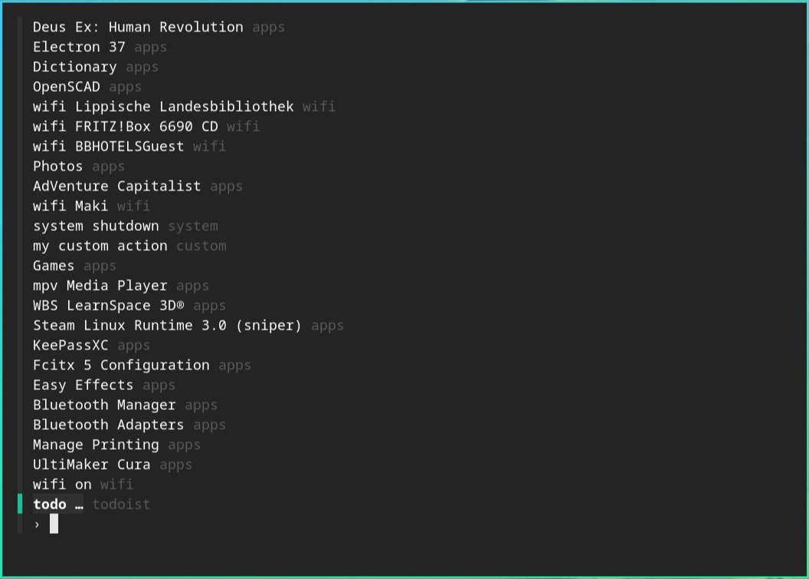

# UberLauncher

A fast-summon TUI launcher focused on dispatching useful actions without breaking flow.

<p align="center">
  
  <br />
  <em>UberLauncher running in foot on Hyprland.</em>
</p>


## About

> I want my launcher to react at the speed of my thoughts - or faster.

UberLauncher is a launcher designed around instant-summon and low friction UI to help you stay in
flow. It turns interruptions into quick, uniform interactions.

Its built-in skills make recurring actions instantly reachable through a single fast interface, like
launching applications, controlling system settings or capturing todos in the moment they come to
mind. \
See the [Features](#features) section for current and planned skills.

The project is still in an early stage and primarily developed on Hyprland.
Expect rough edges, limited documentation, and rapidly evolving ideas.


---

## Setup

### 1. Get and build the launcher

```bash
git clone https://github.com/janlucaklees/uberlauncher
cd uberlauncher
make build
```

AUR packaging is planned.


### 2. Integrate it into your setup

Here is how I currently use it in my Hyprland setup:

```ini
bind = SUPER, SPACE, exec, ~/Projects/uberlauncher/scripts/toggle_uberlauncher.sh
windowrule = float on, center on, pin on, stay_focused on, match:class uberlauncher
```

I am using:
- The great [`foot` terminal](https://codeberg.org/dnkl/foot) for instant startup.
- `zsh -c` to avoid unnecessary shell initialization overhead.
- Window rules to keep the launcher centered, focused and always on top.
- A [small script](./scripts/toggle_uberlauncher.sh) to close the launcher with the same key-binding.

Adjust this however fits your workflow best.


## Configuration

UberLauncher is configured through a simple TOML config located at:
`~/.config/uberlauncher/config.toml`

A fully documented example configuration containing all available options can be found in
[`config/default.toml`](./config/default.toml).


---

## Features
UberLauncher turns interruptions into quick, uniform interactions.

Through its pluggable skill system, a variety of actions become instantly reachable:\
launching applications, switching WiFi, capturing todos, searching the web, or running custom commands.

No remembering commands. No clicking through slow menus. No switching into a different tool just to handle a small task.

UberLauncher provides one interaction model for your system, tools, and applications:\
open → type → enter → done.


### Current built-in skills

**App Launcher**\
Launch applications sourced from `.desktop` files on your system.

**Web-Search**\
Open web searches in your browser using the search engine of your choice.

**System Control**\
Shutdown or reboot your machine.

**Wifi Control**\
Toggle WiFi or connect to saved networks. Requires `nmcli`.

**Todoist Integration**\
Capture todos and send them to your Todoist account.

**Custom Actions**\
User-defined actions executing arbitrary shell commands. See [Configuration](#configuration)


### Planned Features

**Emoji Picker**\
Quickly search and insert emojis without interrupting your workflow.

**Inline Calculator**\
Evaluate mathematical expressions directly inside the launcher.

**Recent File Access**\
Quickly continue working on recently used or downloaded files.

**Calendar Integration**\
Create calendar events without opening a dedicated calendar application.

**Bluetooth Controls**\
Connect devices or switch outputs without navigating desktop menus.

**Improved ranking of actions by recency and usage**\
Improve result ordering based on frequently and recently used actions.

The project is still heavily shaped by day-to-day usage and workflow friction.

---

## Donations

The most valuable contribution to this project is your time and ideas. Open source becomes meaningful through people participating in it.

If you would like to support the project financially, you can do so through the following options:

- [PayPal](https://www.paypal.com/donate/?hosted_button_id=9ZYAV83CAZ5A4)

Thank you for using, sharing, contributing and/or supporting the project in whatever way makes sense to you.

---

## License

The source code for this project is licensed under the Mozilla Public License 2.0.

For details on third-party licensing, bundled libraries, and additional notices, see [NOTICE.md](./NOTICE.md).


---

UberLauncher is a fast, keyboard-driven TUI launcher for Linux focused on instant summon, low friction, and flow-preserving interactions. It combines fuzzy-search with an extensible skill system to make applications, system actions, web searches, todos, and custom commands reachable through one unified interface.

Built primarily for Hyprland and terminal-heavy workflows, UberLauncher is designed for users who value speed, minimalism, extensibility, and staying in flow.
